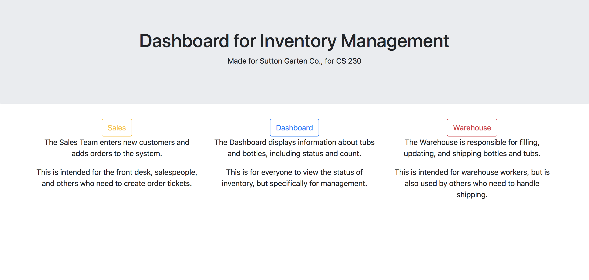
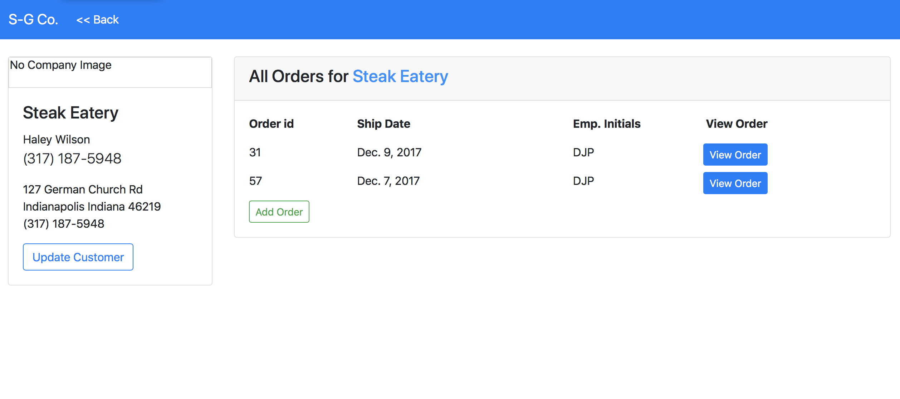
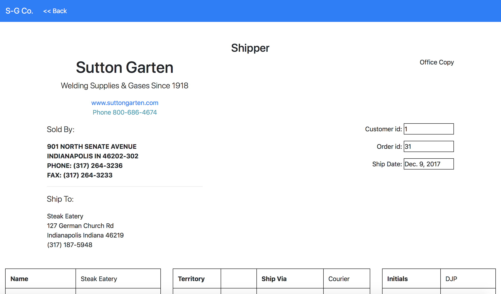
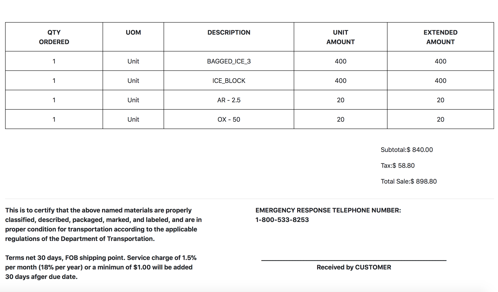
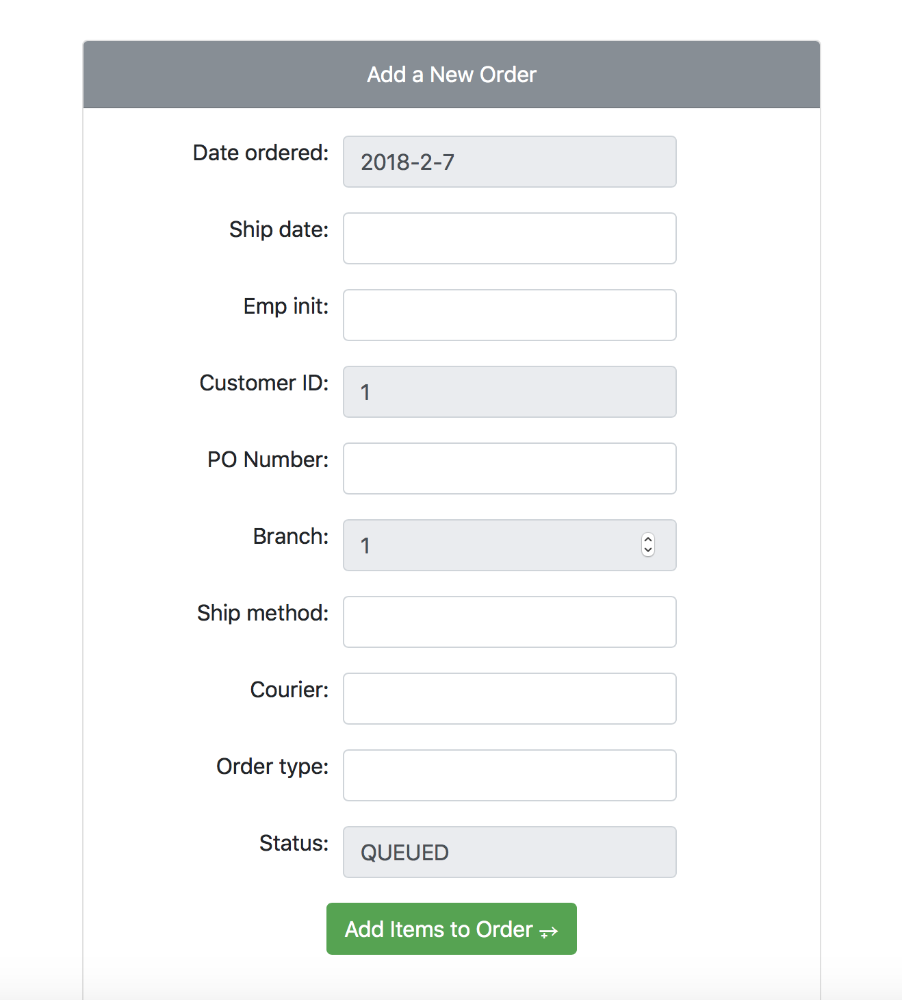
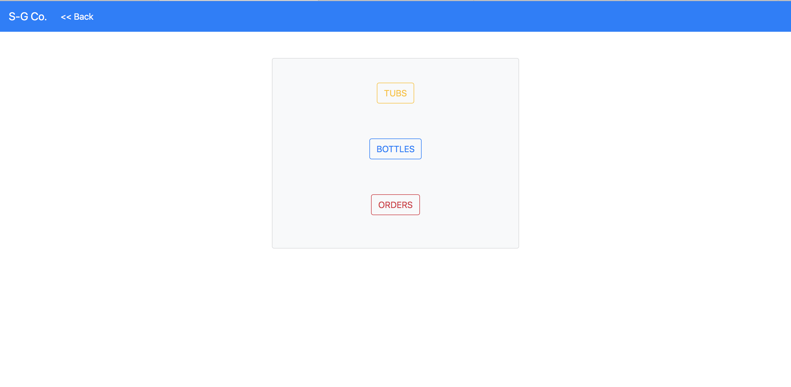

## Dashboard for Inventory Management
___
***To run the project:***

> Prerequites:
* python3
* django

Once python3 and django are installed, go ahead and clone the repo. `cd` into the directory and run `python3 manage.py runserver`. This will run the server on port 8000.  

Open your browser and go to http://localhost:8000/testing.

To double check that the database is restored cleanly for you, make sure to click ALL the delete buttons, and then all the add buttons.  This will prepopulate the database with example customers, orders, items, and tickets.

Now you can click the Home link, which will take you to the main screen of the project.

Here you can navigate to:

### Sales
> Where you will be able to view, add, and update customers and orders

### Dashboard
> Where you will be able to view the current status of the company's assets and orders.

### Warehouse
> Where you will be able to add, update, remove, ship, and return tickets, tubs, and bottles. (tubs and bottles were chose as that is the items my employer ships out the most)

*If you have any questions, please feel free to contact me at dpeachesdev@gmail.com*

### More Photos

